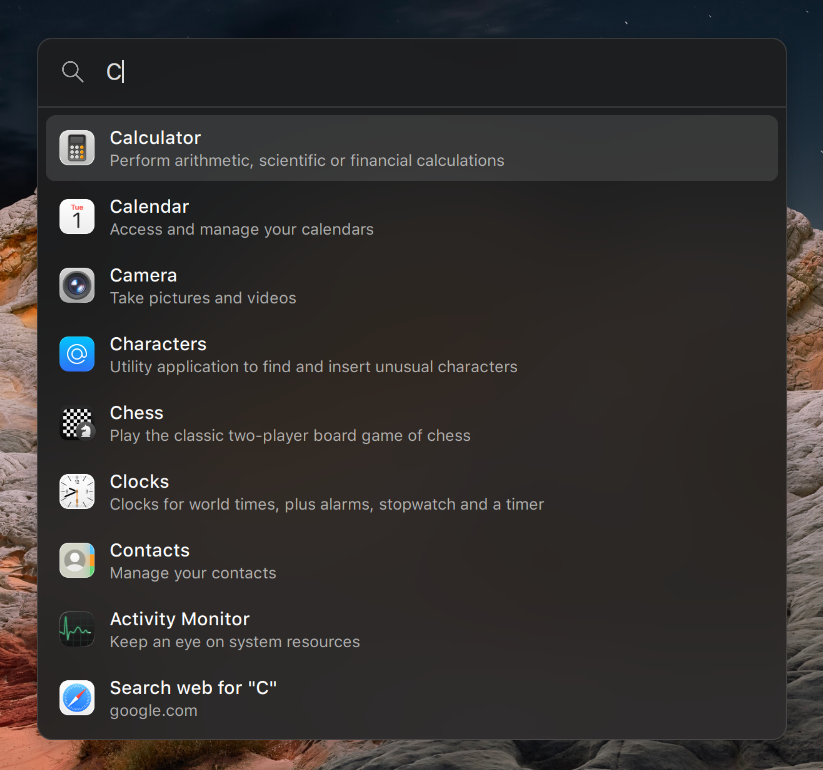
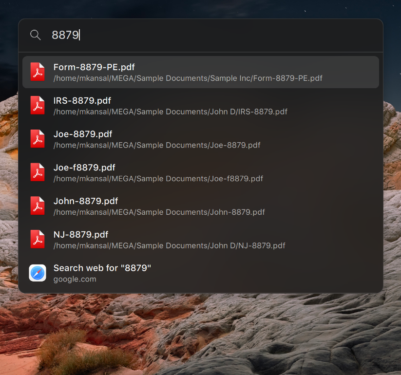
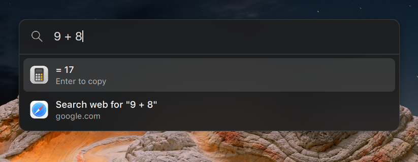

# Lightning Search Launcher

## About

Lightning Search Launcher is a fast, minimal search launcher for GNOME, inspired by macOS Spotlight. From a single
search box it searches applications and files, evaluates calculations, and opens
URLs or web searches.

## Installation

Make sure you're using GNOME.
Run the installer:

```bash
./install.sh
```

You'll be instructed how to configure the launcher.
Defaults to Control + Super + Space to open it.

## Packaging

To pack it for upload to [extensions.gnome.org](https://extensions.gnome.org/upload/), run `./pack.sh`. It creates the zip file in the project directory, gitignored.

## Usage

Type to search. Use the arrow keys (or Tab) to move between results and press
Enter to open the selected one. Escape closes the launcher.
What you can search:

**Apps**: Type part or all of the name of an app - depending on how fuzzy the matching setting is, you can omit some characters in between; for example, on "loose", typing "vsc" will bring up "Visual Studio Code."

**Files**: Type part or all of a file name/path. Same fuzziness rule.

**Calculator**: Type a math expression, like 4 + 3 \* 8 (it follows order of operations). Implicit multiplication works too: `2pi`, `2(3+4)`, and `(2)(3)` multiply automatically. Standard trigonometry functions, roots, and constants work too: Supported functions: `sqrt`, `cbrt`, `abs`, `exp`, `ln`, `log`, `log10`, `log2`, `round`, `rint`, `floor`, `ceil`, `fact`, `rad`, `deg`, `sin`, `cos`, `tan`, `asin`, `acos`, `atan`, `sinh`, `cosh`, `tanh`, `asinh`, `acosh`, `atanh`, `pow`, `fmod`, `hypot`, `min`, `max` (append `d` to a trigonometry function to use degrees instead of radians, e.g. `sind(30)`). Constants: `pi`, `e`.

**Unit conversion**: Convert between units in the same category with `to`, `in`, `into`, `as` or `->`. Example: `10 km to mi`, `5 ft in cm`, `cup to qt`, `100 kph -> mph`, `32 F to C`. Supported categories: length, mass, volume, time, area, speed, storage (byte, kb, mb, gb etc), and temperature.

**URL**: Type a URL/website, like https://example.com, example.com, localhost:3000, 192.168.1.1; Only some domains are recognized if you don't type https://, since the .something kind of naming is used for both files and websites - like .zip, .com, etc.

**Web**: Shown when not very many other things (apps, files, calculator, etc) match what you typed. Defaults to Google, but you can change it.

**Commands**: When the first word you type is a program installed on your PATH (for example `htop`, `git status`, `ls -la`), a "Run in background" result appears and runs the line in the background; press Shift + Enter to run it in your default terminal window instead.

## Controlling from the terminal

You can run it from the terminal, so a custom
`.desktop` file, a GNOME custom keyboard shortcut, or a button mapped to a
keybinding can open the launcher.

The installer places a command in `~/.local/bin`:

```bash
lightning-search open
lightning-search hide
lightning-search search "Some search term"
```

Alternatively:

```bash
gdbus call --session \
  --dest org.gnome.Shell.Extensions.LightningSearch \
  --object-path /org/gnome/Shell/Extensions/LightningSearch \
  --method org.gnome.Shell.Extensions.LightningSearch.Toggle
```

## Configuration

Open the extension's preferences to customize it:

- **Shortcut**: the global keybinding that opens the launcher.
- **Panel**: show or hide the search icon on the right of the top bar.
- **Launcher**: the placeholder text shown in the search box while it is empty,
  whether the search icon is shown and how large its magnifying glass is drawn, and
  whether typing a program name offers to run it in your terminal.
- **Appearance**: the background color of the highlighted result row.
- **Results**: how many application results and how many file results the
  launcher shows at a time.
- **Search**: the search engine used for the “Search web” fallback result.

## Screenshots


 


Note: For you, it may not look exactly like this - it depends on your GNOME Shell theme and other extensions. For example here I have Blur My Shell and a Mac-like GTK theme. If you don't have that, it will just look like a normal GNOME Shell element.

## The reason it exists, despite alternatives

Why not just use the app grid/search that comes with GNOME? It pushes away your entire desktop into those tiny boxes to render the launcher full screen. Not everyone wants that. Also, it's sometimes slow or laggy to open. This extension is fast, because it's more minimal.

Why not Rofi? Unfortunately Rofi doesn't work on GNOME Wayland - it requires wlroots, which GNOME explicitly said they will not implement.

Why not Ulauncher? It requires more styling to feel at home on GNOME.

Why not Search Light? The styling and alignment are a bit off. It doesn't respect your shell theme very well. Also it's finicky on GNOME 50+ - you CAN try to edit the metadata but it won't always actually work.

Why not Vicinae? It doesn't look like your GNOME setup (ignores GTK/shell theme) so you have to theme it separately to match. And the font keeps resetting to the default. Additionally, for some reason it uses adwaita or fallback (often blurry) icons for apps rather than your selected icon theme, and text is blurry on GNOME 50/51.

## License

Copyright (C) 2026 Avimanyu Rimal, Mihier Kansal

This project is licensed under the GNU General Public License v3 or later.
See the LICENSE file for details.

Forked from https://gitlab.com/rimal.avimanyu/lightning-gnome-launcher-extension, see NOTICE.
